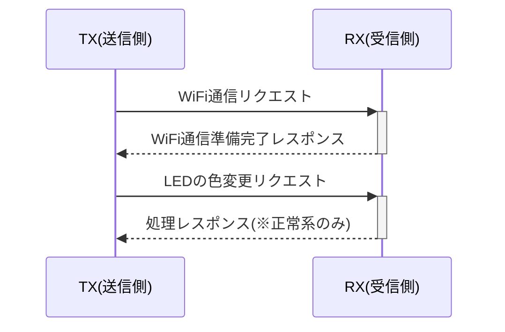

# 【初版】詳細設計書

## 改版履歴
- 初版（2025/6/3） ... 仕様を図解したシーケンス図を追加
- 初版（2025/6/2） ... 初版のため作成

## 仕様（暫定）

『共通』

- F/W ... WiFi経由でデータを送受信できること
- OS ... ~~Amazon FreeRTOSを搭載する~~ 1週間しか工数がないため、RTOSは未搭載

- マイコン(SoC)
  - ESP32-S3-WROOM-1-N16R8
    - CPU ... Tensilica Xtensa LX7
    - Clock ... 240MHz
    - RAM ... 520KB
    - PSRAM ... 8MB
    - Flash ... 16MB
    - WiFi ... Wi-Fi(802.11b/g/n)@2.4GHz

『TX(送信側)』

- 1)　RXに指定したLEDの色データを送信する
- 2)　電文は「`led (RGBの色コード)`」で送る

『RX(受信側)』

- 1)　TXから「`led (RGBの色コード)`」を受信するまでポーリング
- 2)　TXから指定されたLEDの色データをLEDに反映
- 3)　TXに「`led proc ok`」または「`led proc ng`」をレスポンス

### 無線関連

- WiFi (IEEE802.11b/g/n)
- 送受信 ... UDPやESPNOWを使用すること

### 通信フォーマット

- `led (RGBの色コード)`
  - 正常レスポンス：`led proc ok`
  - 異常レスポンス：`led proc ng`