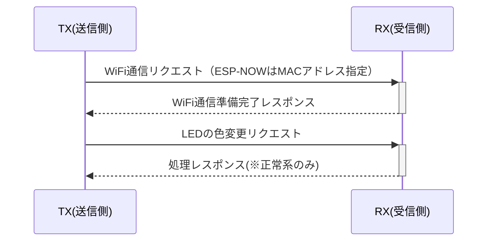

# 【初版】詳細設計書

## 改版履歴
- 初版（2025/6/3） ... シーケンス図、ビルド構成を追記
- 初版（2025/6/2） ... 初版のため作成

## 1.仕様

『共通』

- F/W ... WiFi経由でデータを送受信できること
- OS ... 1週間の開発期間で工数がないため、RTOSは搭載しない

- マイコン(SoC)
  - ESP32-S3-WROOM-1-N16R8
    - CPU ... Tensilica Xtensa LX7
    - Clock ... 240MHz
    - RAM ... 512KB
    - PSRAM ... 8MB
    - Flash ... 16MB
    - WiFi ... Wi-Fi(802.11b/g/n)@2.4GHz

『TX(送信側)』

- 1)　RXに指定したLEDの色データを送信する
- 2)　電文は「`led req (RGBの色コード)`」で送る

『RX(受信側)』

- 1)　TXから「`led req (RGBの色コード)`」を受信するまでポーリング
- 2)　TXから指定されたLEDの色データをLEDに反映
- 3)　TXに「`led proc ok`」または「`led proc ng`」をレスポンス

### 1.1.無線関連

- WiFi (IEEE802.11b/g/n)
- 送受信 ... プロトコルにESP-NOWを使用してデータの送受信ができること

### 1.2.通信フォーマット

#### 1.2.1.通信要求

- `com req` ... 通信要求
  - 正常レスポンス：`com res ok` ... 通信準備OK
  - 異常レスポンス：`com res ng` ... (TBD)通信準備NG

#### 1.2.2.led req (RGBの色コード)

- `led req (RGBの色コード)` ... 指定のLED色にするよう要求
  - 正常レスポンス：`led res ok` ... LEDの色設定OK
  - 異常レスポンス：`led res ng` ... (TBD)LEDの色設定NG

## 2.ビルド構成

Arduino IDEでのビルド構成は下記図の通りである。

- ボード ... "ESP32S3 Dev Module"
- USB CDC On Boot ... "Disabled"
- CPU Frequency ... "240MHz (WiFi)"
- Core Debug Level ... "None"
- USB DFU On Boot ... "Disabled"
- Erase All Flash Before Sketch Upload ... "Disabled"
- Events Run On ... "Core 1"
- Flash Mode ... "QIO 120MHz"
- Flash Size ... "16MB (128Mb)"
- JTAG Adapter ... "Integrated USB JTAG"
- Arduino Runs On ... "Core 1"
- USB Firmware MSC On Boot ... "Disabled"

  

