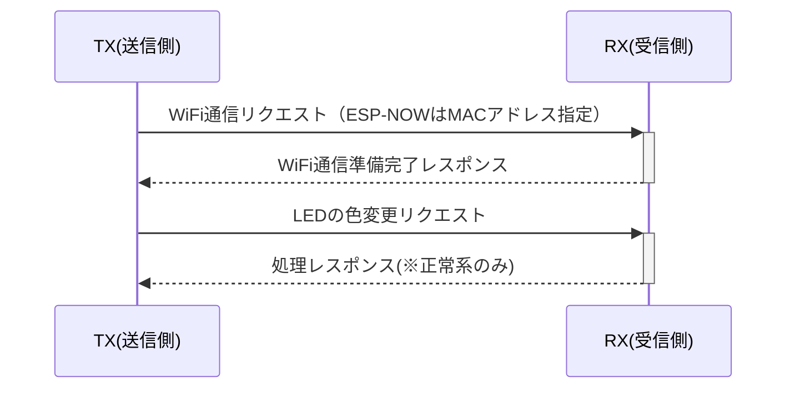

# 【初版】詳細設計書

## 改版履歴
- 初版（2025/6/4） ... H/W仕様とYD-ESP32-S3について追記
- 初版（2025/6/3） ... ESP-NOW、シーケンス図、ビルド構成を追記
- 初版（2025/6/2） ... 初版のため作成

## 1.仕様

## 1.1.H/W仕様

基板はVCC-GNDの[VCC-GND YD-ESP32-S3🔗](https://github.com/vcc-gnd/YD-ESP32-S3)を使用する。

- 基板
  - [VCC-GND YD-ESP32-S3🔗](https://github.com/vcc-gnd/YD-ESP32-S3)
    - マイコン(SoC)
      - ESP32-S3-WROOM-1-N16R8
        - CPU ... Tensilica Xtensa LX7
        - Clock ... 240MHz
        - RAM ... 512KB
        - PSRAM ... 8MB
        - Flash ... 16MB
        - WiFi ... Wi-Fi(802.11b/g/n)@2.4GHz

    - WS2812 (NeoPixel互換RGBLED)
      - ESP32-S3のGPIO48と接続

  

## 1.2.F/W仕様

『共通』

- F/W ... WiFi経由でデータを送受信できること
- OS ... 1週間の開発期間で工数がないため、RTOSは搭載しない

『TX(送信側)』

- 1)　RXに指定したLEDの色データを送信する
- 2)　電文は「`LED REQ (RGBの色コード)`」で送る

『RX(受信側)』

- 1)　TXから「`LED REQ (RGBの色コード)`」を受信するまでポーリング
- 2)　TXから指定されたLEDの色データをLEDに反映
- 3)　TXに「`LED PROC OK`」または「`LED PROC NG`」をレスポンス

### 1.2.1.無線関連

- 物理層 ... WiFi (IEEE802.11b/g/n)
- プロトコル層 ... ESP-NOWを使用してデータの送受信ができること
- データ ... ESP-NOWのデータ部最大250Byteまでのデータとすること
- 暗号 ... 暗号化はしない、平文のみ
- 通信データフォーマット ... 1.2.通信データフォーマットを参考のこと

### 1.2.2.通信データフォーマット

下記のようなフォーマットでESP-NOWの通信データ作成すること。

- データはASCIIの文字列
- 最大250Byte(ESP-NOWのデータ部最大)

#### 1.2.2.1.通信要求リクエスト

- `COM REQ` ... 通通信要求リクエスト
  - 正常レスポンス：`COM RES OK` ... 通信準備OK
  - 異常レスポンス：`COM RES NG` ... (TBD)通信準備NG

#### 1.2.2.2.LED色変更リクエスト

- `LED REQ (RGBの色コード)` ... 指定の色にLEDを変更する要求
  - 正常レスポンス：`LED RES OK` ... LEDの色設定OK
  - 異常レスポンス：`LED RES NG` ... (TBD)LEDの色設定NG

## 2.ビルド構成

Arduino IDEでのビルド構成は下記図の通りである。

- ボード ... "ESP32S3 Dev Module"
- USB CDC On Boot ... "Disabled"
- CPU Frequency ... "240MHz (WiFi)"
- Core Debug Level ... "None"
- USB DFU On Boot ... "Disabled"
- Erase All Flash Before Sketch Upload ... "Disabled"
- Events Run On ... "Core 1"
- Flash Mode ... "QIO 120MHz"
- Flash Size ... "16MB (128Mb)"
- JTAG Adapter ... "Integrated USB JTAG"
- Arduino Runs On ... "Core 1"
- USB Firmware MSC On Boot ... "Disabled"

  

